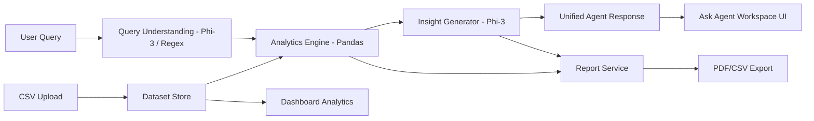

<div align="center">

# 📊 AI Business Intelligence Analyst

[](https://fastapi.tiangolo.com/)
[](https://reactjs.org/)
[](https://pandas.pydata.org/)
[](https://ollama.ai/)

A local-first Business Intelligence workspace powered by React, FastAPI, and local LLMs (Ollama + Phi-3).

</div>

---

## 🚀 Overview

The **AI Business Intelligence Analyst** is a complete, end-to-end data analytics platform designed to run entirely locally. It allows users to upload business datasets, visualize key performance indicators (KPIs), and ask complex business questions in natural language. By utilizing a local LLM via Ollama, all data remains secure and private on your machine—no external API calls required!

## ✨ Features

- 📁 **Data Management**: Upload, preview, and validate CSV datasets seamlessly.
- 📈 **Interactive Dashboards**: View auto-generated KPIs, revenue trends, top products, and regional performance.
- 💬 **Natural Language BI Agent**: Ask business questions in plain English. The agent routes queries to deterministic analytics engines for accurate results and uses AI to generate business-friendly insights.
- 📊 **Dynamic Visualizations**: The UI renders custom charts (bar charts, line charts) based on your query results.
- 📑 **Export & Reporting**: Generate detailed business reports and export them as PDF or CSV.
- 🔒 **Privacy-First**: Powered entirely by local models (Phi-3) and deterministic Python libraries (Pandas/NumPy).

## 🧠 Architecture

The BI pipeline uses a hybrid approach: AI for natural language understanding and insight generation, and deterministic code for all mathematical computations to guarantee accuracy.



## 🛠️ Getting Started

### Prerequisites
- Python 3.10+
- Node.js 18+
- [Ollama](https://ollama.ai/) installed locally

### 1. Backend Setup

Navigate to the backend directory, install the Python dependencies, and start the FastAPI server:

```bash
cd backend
python -m pip install -r requirements.txt
python -m uvicorn backend.main:app --reload --host 127.0.0.1 --port 8000
```

### 2. Frontend Setup

Navigate to the frontend directory, install the Node modules, and run the Vite dev server:

```bash
cd frontend
npm install
npm run dev
```

### 3. Local AI Setup

Pull and run the Phi-3 model using Ollama. This model is used for query parsing fallback and insight generation.

```bash
ollama pull phi3
ollama run phi3
```

> **Note**: The backend expects Ollama to be running at `http://127.0.0.1:11434` by default.

## 💡 Example Queries

Try asking the agent these questions in the **Ask Agent** workspace:

- *"Show revenue trend"*
- *"Compare North and South sales"*
- *"Why did revenue drop in March compared to January?"*
- *"Predict the revenue for the next 30 days based on historical data."*
- *"Which region generated the highest revenue?"*
- *"Which product generated the highest total profit?"*

## 🏗️ Core Technologies
- **Frontend**: React, Vite, Recharts
- **Backend**: FastAPI, Pandas, NumPy, Scikit-learn
- **AI & NLP**: Ollama, Microsoft Phi-3
- **Reporting**: ReportLab (PDF Generation)
